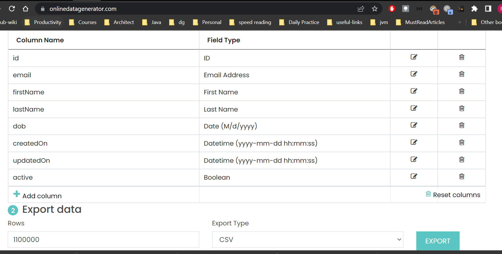

## User Management System (UMS)
UMS maintains the user details which is used in subsequent projects.
Created Sample data by using https://www.onlinedatagenerator.com/ 


### Run the Application
If you use gradle, run the following command in a terminal window (in the complete) directory:
```
./gradlew bootRun
```

If you use Maven, run the following command in a terminal window (in the complete) directory:
```
./mvnw spring-boot:run
```

After running the command check for health api : [http://localhost:8084/actuator/health](http://localhost:8084/actuator/health)
